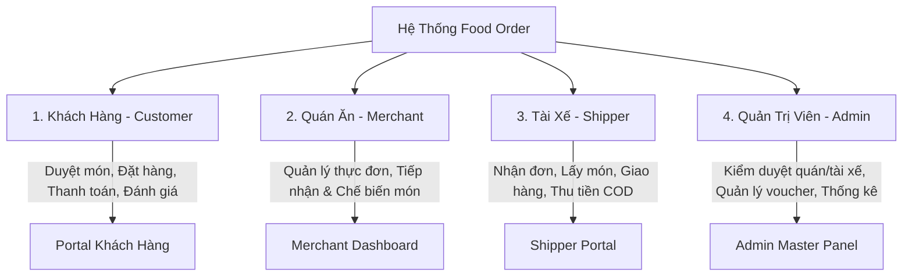
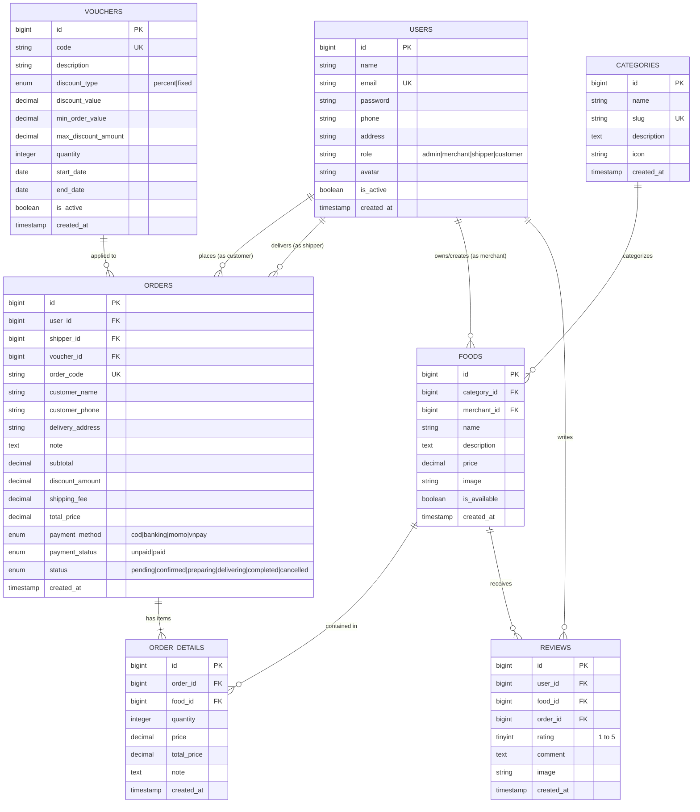
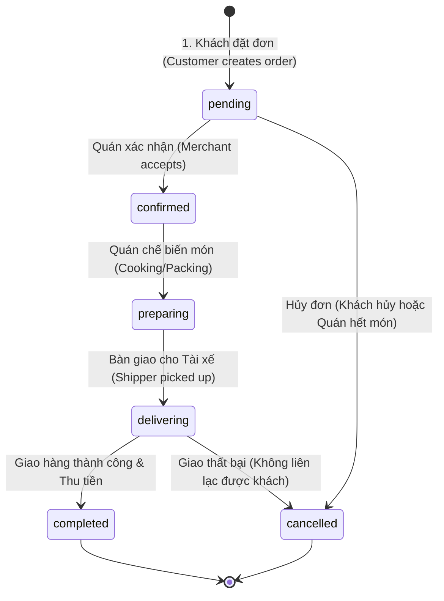
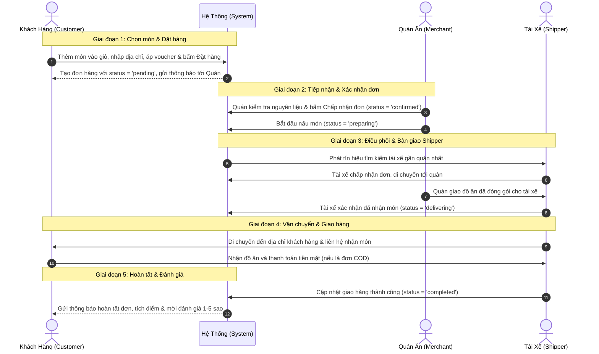

# 📋 TÀI LIỆU ĐẶC TẢ YÊU CẦU HỆ THỐNG (PROJECT SPECIFICATION)
# HỆ THỐNG ĐẶT MÓN ĂN TRỰC TUYẾN - FOOD ORDER SYSTEM

---

## 1. TỔNG QUAN HỆ THỐNG (SYSTEM OVERVIEW)

### 1.1. Mục tiêu dự án
**Food Order** là nền tảng web ứng dụng thương mại điện tử chuyên biệt cho ngành dịch vụ ẩm thực (F&B), được xây dựng trên nền tảng **Laravel Framework** và cơ sở dữ liệu **MySQL**. Hệ thống kết nối liền mạch giữa 4 bên tham gia: Khách hàng, Quán ăn, Tài xế và Đội ngũ Quản trị viên, mang đến trải nghiệm đặt món nhanh chóng, minh bạch và tiện lợi.

- **Frontend:** HTML5, CSS3/Bootstrap, JavaScript (Vanilla / Alpine.js / Blade Template).
- **Backend:** Laravel (PHP 8.2+), Eloquent ORM, RESTful Controller.
- **Database:** MySQL 8.0+.
- **Authentication & Security:** Laravel Auth, Session-based authentication, CSRF protection, RBAC (Role-Based Access Control).

---

### 1.2. Phân quyền 4 vai trò người dùng (Roles & Permissions)

| STT | Vai trò (Role) | Ký hiệu mã (`role`) | Mô tả trách nhiệm chính |
| :--- | :--- | :---: | :--- |
| **1** | **Khách hàng** *(Customer)* | `customer` | Xem menu, tìm kiếm món ăn, thêm vào giỏ hàng, áp mã giảm giá, đặt hàng, theo dõi trạng thái giao hàng theo thời gian thực và đánh giá/review sau khi nhận món. |
| **2** | **Quán ăn** *(Merchant)* | `merchant` | Quản lý danh mục và thực đơn món ăn, giá bán, tình trạng còn/hết hàng; tiếp nhận đơn hàng, xác nhận chuẩn bị món và bàn giao cho tài xế. |
| **3** | **Tài xế** *(Shipper)* | `shipper` | Xem danh sách đơn sẵn sàng giao gần vị trí, nhận đơn hàng, di chuyển đến quán lấy món, cập nhật trạng thái đang giao và xác nhận giao thành công / thu tiền COD. |
| **4** | **Quản trị viên** *(Admin)* | `admin` | Toàn quyền kiểm soát hệ thống: duyệt tài khoản quán ăn/tài xế, quản lý người dùng, tạo chương trình voucher toàn sàn, giám sát doanh thu và xử lý tranh chấp/khiếu nại. |

---

## 2. CẤU TRÚC CƠ SỞ DỮ LIỆU (DATABASE SCHEMA)

### 2.1. Sơ đồ quan hệ thực thể (ERD Diagram)

---

### 2.2. Chi tiết các bảng & Khóa ngoại (Foreign Keys)

#### 1. Bảng `users` (Người dùng hệ thống)
| Tên cột | Kiểu dữ liệu | Ràng buộc | Mô tả |
| :--- | :--- | :--- | :--- |
| `id` | `BIGINT UNSIGNED` | `AUTO_INCREMENT, PRIMARY KEY` | Khóa chính |
| `name` | `VARCHAR(255)` | `NOT NULL` | Họ và tên |
| `email` | `VARCHAR(255)` | `NOT NULL, UNIQUE` | Địa chỉ email đăng nhập |
| `password` | `VARCHAR(255)` | `NOT NULL` | Mật khẩu mã hóa (Bcrypt) |
| `phone` | `VARCHAR(20)` | `NULLABLE` | Số điện thoại liên lạc |
| `address` | `TEXT` | `NULLABLE` | Địa chỉ mặc định |
| `role` | `ENUM` | `DEFAULT 'customer'` | Vai trò: `'admin'`, `'merchant'`, `'shipper'`, `'customer'` |
| `avatar` | `VARCHAR(255)` | `NULLABLE` | Đường dẫn ảnh đại diện |
| `is_active` | `BOOLEAN` | `DEFAULT TRUE` | Trạng thái kích hoạt tài khoản |
| `timestamps`| `TIMESTAMP` | `NULLABLE` | `created_at`, `updated_at` |

---

#### 2. Bảng `categories` (Danh mục món ăn)
| Tên cột | Kiểu dữ liệu | Ràng buộc | Mô tả |
| :--- | :--- | :--- | :--- |
| `id` | `BIGINT UNSIGNED` | `AUTO_INCREMENT, PRIMARY KEY` | Khóa chính |
| `name` | `VARCHAR(255)` | `NOT NULL` | Tên danh mục (Món chính, Ăn vặt, Đồ uống...) |
| `slug` | `VARCHAR(255)` | `NULLABLE, UNIQUE` | Đường dẫn thân thiện SEO (`mon-chinh`) |
| `description`| `TEXT` | `NULLABLE` | Mô tả danh mục |
| `icon` | `VARCHAR(100)` | `NULLABLE` | Biểu tượng FontAwesome (`fa-utensils`) |
| `timestamps`| `TIMESTAMP` | `NULLABLE` | `created_at`, `updated_at` |

---

#### 3. Bảng `foods` (Món ăn)
| Tên cột | Kiểu dữ liệu | Ràng buộc | Mô tả |
| :--- | :--- | :--- | :--- |
| `id` | `BIGINT UNSIGNED` | `AUTO_INCREMENT, PRIMARY KEY` | Khóa chính |
| `category_id`| `BIGINT UNSIGNED` | `FOREIGN KEY (categories.id) ON DELETE CASCADE` | Thuộc danh mục nào |
| `merchant_id`| `BIGINT UNSIGNED` | `FOREIGN KEY (users.id) ON DELETE SET NULL` | Thuộc quán ăn / người đăng nào |
| `name` | `VARCHAR(255)` | `NOT NULL` | Tên món ăn |
| `description`| `TEXT` | `NULLABLE` | Mô tả chi tiết món ăn, nguyên liệu |
| `price` | `DECIMAL(10,2)` | `NOT NULL` | Giá bán lẻ niêm yết (VNĐ) |
| `image` | `VARCHAR(255)` | `NULLABLE` | Ảnh minh họa món ăn |
| `is_available`| `BOOLEAN` | `DEFAULT TRUE` | Trạng thái còn hàng (`true`) hoặc tạm hết (`false`) |
| `timestamps`| `TIMESTAMP` | `NULLABLE` | `created_at`, `updated_at` |

---

#### 4. Bảng `vouchers` (Mã khuyến mãi / Giảm giá)
| Tên cột | Kiểu dữ liệu | Ràng buộc | Mô tả |
| :--- | :--- | :--- | :--- |
| `id` | `BIGINT UNSIGNED` | `AUTO_INCREMENT, PRIMARY KEY` | Khóa chính |
| `code` | `VARCHAR(50)` | `NOT NULL, UNIQUE` | Mã voucher (vd: `FREESHIP`, `GIAM30K`) |
| `description`| `TEXT` | `NULLABLE` | Nội dung mô tả ưu đãi |
| `discount_type`| `ENUM` | `NOT NULL` | Loại giảm: `'percent'` (%) hoặc `'fixed'` (tiền cố định) |
| `discount_value`| `DECIMAL(10,2)`| `NOT NULL` | Giá trị giảm (vd: `20` cho 20% hoặc `30000` cho 30k) |
| `min_order_value`| `DECIMAL(10,2)`| `DEFAULT 0` | Giá trị đơn tối thiểu để áp dụng |
| `max_discount_amount`| `DECIMAL(10,2)`| `NULLABLE` | Giảm tối đa bao nhiêu tiền (nếu giảm %) |
| `quantity` | `INT` | `DEFAULT 0` | Số lượt dùng còn lại |
| `start_date`| `DATE` | `NOT NULL` | Ngày bắt đầu hiệu lực |
| `end_date` | `DATE` | `NOT NULL` | Ngày hết hạn |
| `is_active` | `BOOLEAN` | `DEFAULT TRUE` | Kích hoạt chương trình |
| `timestamps`| `TIMESTAMP` | `NULLABLE` | `created_at`, `updated_at` |

---

#### 5. Bảng `orders` (Đơn hàng)
| Tên cột | Kiểu dữ liệu | Ràng buộc | Mô tả |
| :--- | :--- | :--- | :--- |
| `id` | `BIGINT UNSIGNED` | `AUTO_INCREMENT, PRIMARY KEY` | Khóa chính |
| `order_code`| `VARCHAR(50)` | `NOT NULL, UNIQUE` | Mã đơn hàng (vd: `ORD-20260820-8899`) |
| `user_id` | `BIGINT UNSIGNED` | `FOREIGN KEY (users.id) ON DELETE SET NULL` | ID Khách hàng đặt mua |
| `shipper_id`| `BIGINT UNSIGNED` | `FOREIGN KEY (users.id) ON DELETE SET NULL` | ID Tài xế phụ trách giao |
| `voucher_id`| `BIGINT UNSIGNED` | `FOREIGN KEY (vouchers.id) ON DELETE SET NULL` | ID Mã khuyến mãi áp dụng |
| `customer_name`| `VARCHAR(255)` | `NOT NULL` | Tên người nhận hàng |
| `customer_phone`| `VARCHAR(20)` | `NOT NULL` | Số điện thoại nhận hàng |
| `delivery_address`| `TEXT` | `NOT NULL` | Địa chỉ giao hàng chi tiết |
| `note` | `TEXT` | `NULLABLE` | Ghi chú đơn hàng (ít cay, không hành...) |
| `subtotal` | `DECIMAL(10,2)` | `NOT NULL` | Tổng tiền hàng trước giảm giá |
| `discount_amount`| `DECIMAL(10,2)`| `DEFAULT 0` | Số tiền được giảm giá |
| `shipping_fee`| `DECIMAL(10,2)` | `DEFAULT 0` | Phí vận chuyển |
| `total_price`| `DECIMAL(10,2)` | `NOT NULL` | Tổng tiền thanh toán cuối cùng |
| `payment_method`| `ENUM` | `DEFAULT 'cod'` | Phương thức: `'cod'`, `'banking'`, `'momo'`, `'vnpay'` |
| `payment_status`| `ENUM` | `DEFAULT 'unpaid'` | Trạng thái thanh toán: `'unpaid'`, `'paid'` |
| `status` | `ENUM` | `DEFAULT 'pending'` | Trạng thái đơn hàng (xem mục 3.2) |
| `timestamps`| `TIMESTAMP` | `NULLABLE` | `created_at`, `updated_at` |

---

#### 6. Bảng `order_details` (Chi tiết món ăn trong đơn hàng)
| Tên cột | Kiểu dữ liệu | Ràng buộc | Mô tả |
| :--- | :--- | :--- | :--- |
| `id` | `BIGINT UNSIGNED` | `AUTO_INCREMENT, PRIMARY KEY` | Khóa chính |
| `order_id` | `BIGINT UNSIGNED` | `FOREIGN KEY (orders.id) ON DELETE CASCADE` | Thuộc đơn hàng nào |
| `food_id` | `BIGINT UNSIGNED` | `FOREIGN KEY (foods.id) ON DELETE CASCADE` | Món ăn nào |
| `quantity` | `INT` | `NOT NULL` | Số lượng đặt mua |
| `price` | `DECIMAL(10,2)` | `NOT NULL` | Đơn giá tại thời điểm mua |
| `total_price`| `DECIMAL(10,2)` | `NOT NULL` | Thành tiền (`quantity * price`) |
| `note` | `TEXT` | `NULLABLE` | Ghi chú riêng cho từng món |
| `timestamps`| `TIMESTAMP` | `NULLABLE` | `created_at`, `updated_at` |

---

#### 7. Bảng `reviews` (Đánh giá món ăn & dịch vụ)
| Tên cột | Kiểu dữ liệu | Ràng buộc | Mô tả |
| :--- | :--- | :--- | :--- |
| `id` | `BIGINT UNSIGNED` | `AUTO_INCREMENT, PRIMARY KEY` | Khóa chính |
| `user_id` | `BIGINT UNSIGNED` | `FOREIGN KEY (users.id) ON DELETE CASCADE` | Người gửi đánh giá |
| `food_id` | `BIGINT UNSIGNED` | `FOREIGN KEY (foods.id) ON DELETE CASCADE` | Món ăn được đánh giá |
| `order_id` | `BIGINT UNSIGNED` | `FOREIGN KEY (orders.id) ON DELETE CASCADE` | Kèm theo đơn hàng nào |
| `rating` | `TINYINT UNSIGNED`| `NOT NULL` | Điểm số từ 1 đến 5 sao |
| `comment` | `TEXT` | `NULLABLE` | Nhận xét chi tiết |
| `image` | `VARCHAR(255)` | `NULLABLE` | Ảnh feedback thực tế |
| `timestamps`| `TIMESTAMP` | `NULLABLE` | `created_at`, `updated_at` |

---

## 3. LUỒNG NGHIỆP VỤ ĐƠN HÀNG (ORDER WORKFLOW)

### 3.1. Sơ đồ trạng thái đơn hàng (Order State Diagram)

---

### 3.2. 5 Giai đoạn xử lý đơn hàng chi tiết

---

### 3.3. Bảng quy định trạng thái `status` trong Database

| Mã trạng thái (`status`) | Tên hiển thị (Tiếng Việt) | Người chịu trách nhiệm cập nhật | Ý nghĩa nghiệp vụ |
| :--- | :--- | :---: | :--- |
| `pending` | **Chờ xác nhận** | Khách hàng (Hệ thống) | Đơn hàng mới được tạo từ trang giỏ hàng/thanh toán, đang chờ quán ăn phản hồi. |
| `confirmed` | **Đã xác nhận** | Quán ăn (Merchant) | Quán ăn kiểm tra đủ món và đồng ý thực hiện đơn hàng. |
| `preparing` | **Đang chuẩn bị món** | Quán ăn (Merchant) | Bếp đang tiến hành nấu nướng, đóng gói bao bì sẵn sàng bàn giao. |
| `delivering` | **Đang giao hàng** | Tài xế (Shipper) | Tài xế đã lấy món từ quán và đang trên đường di chuyển đến khách hàng. |
| `completed` | **Giao thành công** | Tài xế (Shipper) | Khách đã nhận đồ ăn, thu tiền xong (nếu COD). Đơn kết thúc thành công. |
| `cancelled` | **Đã hủy đơn** | Khách / Quán / Admin | Đơn bị hủy do khách đổi ý (khi còn `pending`), quán hết món, hoặc giao không thành công. |

---

## 4. DANH SÁCH CHỨC NĂNG THEO VAI TRÒ (FEATURE LIST)

### 4.1. Khách Hàng (Customer Portal)
1. **Xác thực & Tài khoản (Authentication & Profile):**
   - Đăng ký tài khoản khách hàng, Đăng nhập, Đăng xuất, Quên mật khẩu.
   - Quản lý thông tin cá nhân, cập nhật số điện thoại và danh sách địa chỉ giao hàng.
2. **Khám phá thực đơn (Food Browsing & Search):**
   - Trang chủ hiển thị danh mục món ăn dạng Tab/Pills.
   - Lọc món ăn theo danh mục, khoảng giá, trạng thái còn hàng.
   - Thanh tìm kiếm món ăn theo từ khóa thông minh (Full-text search).
   - Xem chi tiết món ăn (ảnh phóng to, thành phần, lượt đánh giá trung bình).
3. **Giỏ hàng (Shopping Cart):**
   - Thêm món vào giỏ hàng từ trang chủ hoặc trang chi tiết món.
   - Drawer giỏ hàng kéo trượt hiển thị tức thì số lượng món, đơn giá, tổng tiền.
   - Tăng, giảm số lượng hoặc xóa món khỏi giỏ hàng.
4. **Đặt hàng & Thanh toán (Checkout):**
   - Form nhập địa chỉ nhận hàng, họ tên, số điện thoại và ghi chú giao hàng.
   - Nhập mã voucher giảm giá (kiểm tra điều kiện đơn tối thiểu, số lượt còn lại).
   - Chọn phương thức thanh toán: Tiền mặt khi nhận hàng (COD), Chuyển khoản ngân hàng (QR Code).
5. **Theo dõi đơn hàng & Đánh giá (Order Tracking & Reviews):**
   - Xem lịch sử các đơn hàng đã đặt.
   - Theo dõi trạng thái tiến độ đơn hàng thời gian thực qua thanh Progress Bar (`pending` $\rightarrow$ `completed`).
   - Gửi đánh giá số sao (1-5 sao), để lại nhận xét và hình ảnh feedback sau khi nhận đồ ăn.

---

### 4.2. Quán Ăn (Merchant Dashboard)
1. **Quản lý Thực đơn & Danh mục:**
   - Thêm mới món ăn: Tên món, danh mục, giá bán, hình ảnh, mô tả chi tiết.
   - Chỉnh sửa thông tin món ăn, bật/tắt công tắc nhanh tình trạng "Còn hàng / Tạm hết món".
   - Quản lý các nhóm danh mục món ăn của quán.
2. **Tiếp nhận & Xử lý Đơn hàng:**
   - Chuông thông báo âm thanh và pop-up khi có đơn hàng mới phát sinh.
   - Bấm nút **"Chấp nhận đơn"** hoặc **"Từ chối đơn"** (kèm lý do hết nguyên liệu).
   - Chuyển trạng thái sang **"Đang chế biến"** và **"Sẵn sàng giao"**.
3. **Báo cáo Doanh thu Quán:**
   - Thống kê số lượng đơn hàng theo ngày/tuần/tháng.
   - Biểu đồ doanh thu thực nhận sau khi trừ chiết khấu sàn.

---

### 4.3. Tài Xế (Shipper Portal)
1. **Tiếp nhận đơn vận chuyển:**
   - Xem danh sách các đơn hàng gần khu vực đang cần tài xế (`preparing` $\rightarrow$ sẵn sàng giao).
   - Xem thông tin địa chỉ quán lấy hàng và địa chỉ khách nhận hàng.
   - Bấm **"Nhận đơn"**.
2. **Cập nhật quá trình giao:**
   - Cập nhật trạng thái: **"Đã lấy hàng từ quán"** $\rightarrow$ chuyển đơn sang `delivering`.
   - Nút gọi điện trực tiếp nhanh cho Khách hàng / Quán ăn.
   - Xác nhận **"Giao hàng thành công"** $\rightarrow$ hoàn tất đơn `completed`, ghi nhận thu tiền COD.
3. **Quản lý thu nhập tài xế:**
   - Xem lịch sử các cuốc giao hàng trong ngày.
   - Thống kê tiền cước giao hàng đã nhận và tiền COD đang tạm giữ.

---

### 4.4. Quản Trị Viên (Admin Master Panel)
1. **Bảng điều khiển tổng quan (Dashboard Overview):**
   - Thống kê số liệu toàn sàn: Tổng doanh thu, Tổng số đơn hàng, Đơn hoàn thành, Đơn bị hủy.
   - Biểu đồ tăng trưởng người dùng mới, lượng đơn theo khung giờ vàng trong ngày.
2. **Quản lý Người dùng & Phân quyền (User Management):**
   - Quản lý danh sách tài khoản: Customer, Merchant, Shipper, Admin.
   - Khóa/Mở khóa tài khoản khi có vi phạm.
   - Phê duyệt hồ sơ đăng ký mở quán ăn mới hoặc tài xế mới.
3. **Quản lý Chương trình Khuyến mãi (Voucher Engine):**
   - Tạo mã giảm giá toàn sàn: Giảm %, giảm tiền cố định, mã miễn phí vận chuyển.
   - Cấu hình số lượt tối đa, hạn sử dụng, giá trị đơn tối thiểu.
4. **Giám sát Đơn hàng & Quản lý Đánh giá:**
   - Tra cứu chi tiết bất kỳ đơn hàng nào theo mã `order_code`.
   - Xử lý khiếu nại hoàn tiền khi xảy ra tranh chấp giữa Khách - Quán - Tài xế.
   - Kiểm duyệt các bài đánh giá (review), ẩn các bình luận tiêu cực hoặc vi phạm tiêu chuẩn cộng đồng.

---

## 5. KẾ HOẠCH TRIỂN KHAI THEO GIAI ĐOẠN (ROADMAP)

- [x] **Giai đoạn 1 (Nền tảng):** Thiết kế Database Schema, Models, Migrations, Seeders, Controller & Giao diện trang chủ hiển thị món ăn.
- [ ] **Giai đoạn 2 (Giỏ hàng & Đặt hàng):** Triển khai `CartController`, cập nhật bảng `orders` đầy đủ trường, xây dựng trang `Checkout` và lưu đơn hàng vào DB.
- [ ] **Giai đoạn 3 (Xác thực & Khách hàng):** Tích hợp Auth (Đăng ký, Đăng nhập), trang xem lịch sử đơn hàng và thanh theo dõi tiến độ đơn.
- [ ] **Giai đoạn 4 (Merchant & Shipper Portal):** Xây dựng giao diện nhận đơn cho Quán ăn và màn hình giao đơn cho Tài xế.
- [ ] **Giai đoạn 5 (Admin Panel & Vouchers):** Hoàn thiện Dashboard thống kê, quản lý người dùng, tạo mã voucher và hệ thống đánh giá sao (Reviews).
