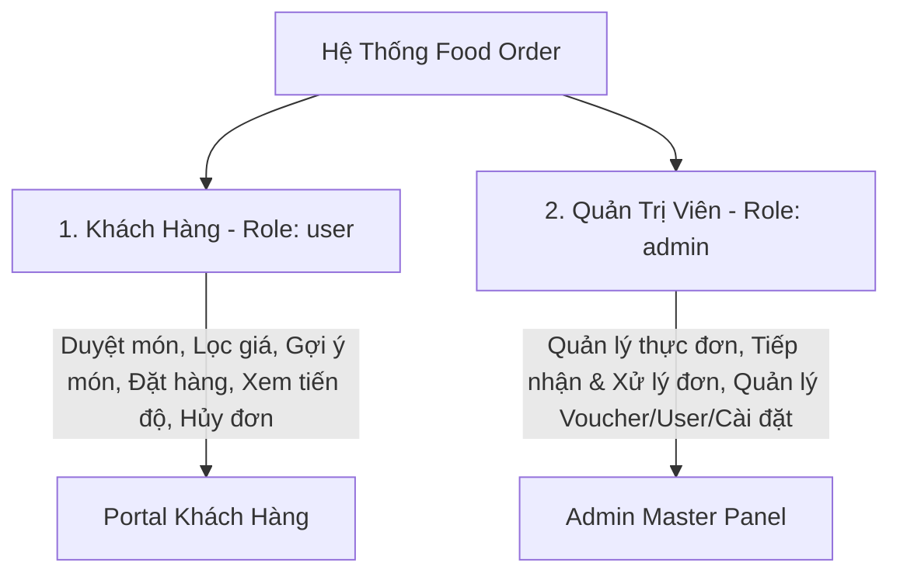
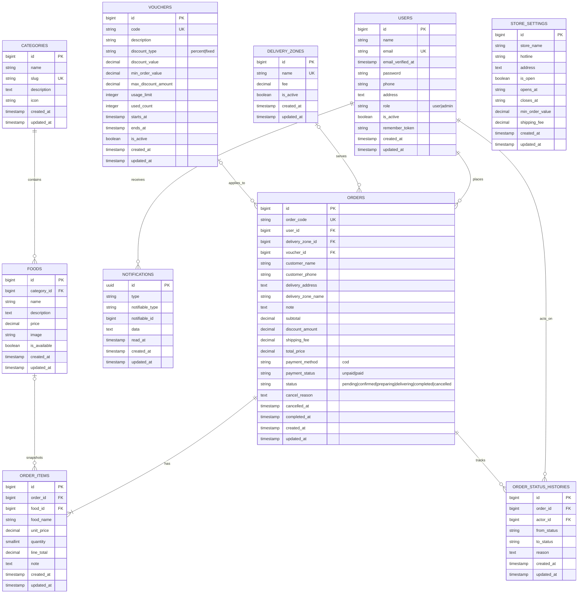
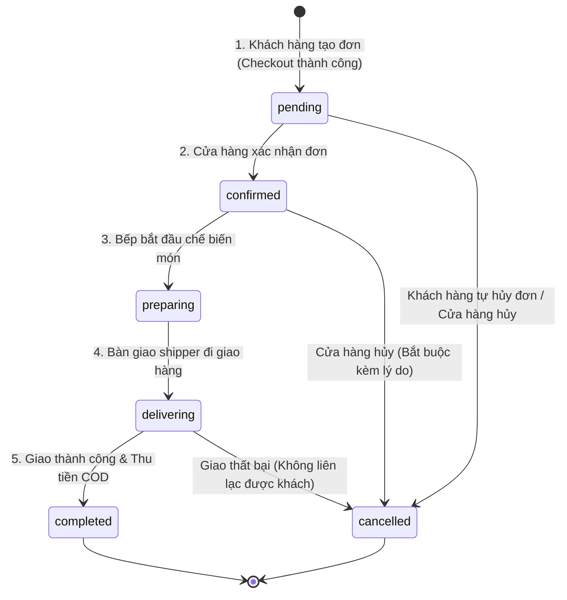

# 📋 TÀI LIỆU ĐẶC TẢ YÊU CẦU HỆ THỐNG (PROJECT SPECIFICATION)
# HỆ THỐNG ĐẶT MÓN ĂN TRỰC TUYẾN - FOOD ORDER SYSTEM
### (Phiên bản Website Cửa Hàng Độc Lập - Single-Store Food Ordering System)

---

## 1. TỔNG QUAN HỆ THỐNG (SYSTEM OVERVIEW)

### 1.1. Mục tiêu dự án
**Food Order** là nền tảng web ứng dụng thương mại điện tử chuyên biệt phục vụ hoạt động đặt món và giao thức ăn trực tuyến cho một cửa hàng / thương hiệu ẩm thực độc lập (Single-Store Model). 

Hệ thống được thiết kế tối ưu, khép kín quy trình từ khâu duyệt thực đơn, trợ lý chọn món, quản lý giỏ hàng, xác thực thông tin giao hàng, tính phí ship theo khu vực, áp mã khuyến mãi, cho đến khâu tiếp nhận, chế biến, vận chuyển và bàn giao đơn hàng.

* **Kiến trúc & Công nghệ:**
  * **Backend:** Laravel Framework (PHP 8.2+ / 8.3), RESTful API Controller, Eloquent ORM, Session-based Authentication & CSRF Protection.
  * **Frontend:** Laravel Blade Templates, HTML5, CSS3 / Custom CSS, Vanilla JavaScript, Font Awesome Icons.
  * **Database:** MySQL 8.0+ (Local / Production), SQLite In-Memory (Automated Testing).
  * **Asset Bundler:** Vite.
  * **Kiểm thử tự động:** PHPUnit (Feature Tests & Unit Tests, 100% test coverage cho các luồng nghiệp vụ).

---

### 1.2. Phân quyền 2 vai trò người dùng (Roles & Permissions)

Hệ thống tập trung vào mô hình vận hành của một cửa hàng ẩm thực với **02 vai trò người dùng** rõ ràng:

```mermaid
graph TD
    System[Hệ Thống Food Order] --> Customer[1. Khách Hàng - Role: user]
    System --> Admin[2. Quản Trị Viên - Role: admin]

    Customer -->|Duyệt món, Lọc giá, Gợi ý món, Đặt hàng, Xem tiến độ, Hủy đơn| AppCustomer[Portal Khách Hàng]
    Admin -->|Quản lý thực đơn, Tiếp nhận & Xử lý đơn, Quản lý Voucher/User/Cài đặt| AppAdmin[Admin Master Panel]
```

| STT | Vai trò (Role) | Ký hiệu mã (`role`) | Mô tả trách nhiệm & Quyền hạn |
| :---: | :--- | :---: | :--- |
| **1** | **Khách hàng** *(Customer)* | `user` | Đăng ký, đăng nhập tài khoản; duyệt thực đơn, lọc giá, tìm kiếm món ăn; sử dụng Trợ lý gợi ý món ăn; thêm món vào giỏ hàng; áp dụng voucher khuyến mãi; chọn khu vực giao hàng; đặt hàng COD; theo dõi tiến độ đơn hàng theo thời gian thực; tự hủy đơn khi còn ở trạng thái chờ xác nhận; quản lý thông tin cá nhân và nhận thông báo trạng thái đơn hàng. |
| **2** | **Quản trị viên** *(Store Admin)* | `admin` | Toàn quyền kiểm soát và vận hành cửa hàng: xem dashboard thống kê doanh thu / đơn hàng / top món bán chạy; quản lý danh mục và thực đơn món ăn (thêm, sửa, tải ảnh, bật/tắt còn hàng); duyệt và cập nhật trạng thái đơn hàng theo máy trạng thái nghiêm ngặt; xuất dữ liệu đơn hàng ra file CSV; quản lý người dùng (khóa/mở khóa); quản lý chương trình khuyến mãi (Voucher); cấu hình khu vực giao hàng (phí ship) và thiết lập vận hành cửa hàng (giờ mở/đóng cửa, đơn tối thiểu). |

---

## 2. CẤU TRÚC CƠ SỞ DỮ LIỆU (DATABASE SCHEMA)

### 2.1. Sơ đồ quan hệ thực thể (ERD Diagram)

```mermaid
erDiagram
    USERS ||--o{ ORDERS : "places"
    USERS ||--o{ ORDER_STATUS_HISTORIES : "acts_on"
    USERS ||--o{ NOTIFICATIONS : "receives"
    CATEGORIES ||--o{ FOODS : "contains"
    ORDERS ||--|{ ORDER_ITEMS : "has"
    FOODS o|--o{ ORDER_ITEMS : "snapshots"
    DELIVERY_ZONES o|--o{ ORDERS : "serves"
    VOUCHERS o|--o{ ORDERS : "applies_to"
    ORDERS ||--o{ ORDER_STATUS_HISTORIES : "tracks"

    USERS {
        bigint id PK
        string name
        string email UK
        timestamp email_verified_at
        string password
        string phone
        text address
        string role "user|admin"
        boolean is_active
        string remember_token
        timestamp created_at
        timestamp updated_at
    }

    CATEGORIES {
        bigint id PK
        string name
        string slug UK
        text description
        string icon
        timestamp created_at
        timestamp updated_at
    }

    FOODS {
        bigint id PK
        bigint category_id FK
        string name
        text description
        decimal price
        string image
        boolean is_available
        timestamp created_at
        timestamp updated_at
    }

    VOUCHERS {
        bigint id PK
        string code UK
        string description
        string discount_type "percent|fixed"
        decimal discount_value
        decimal min_order_value
        decimal max_discount_amount
        integer usage_limit
        integer used_count
        timestamp starts_at
        timestamp ends_at
        boolean is_active
        timestamp created_at
        timestamp updated_at
    }

    DELIVERY_ZONES {
        bigint id PK
        string name UK
        decimal fee
        boolean is_active
        timestamp created_at
        timestamp updated_at
    }

    STORE_SETTINGS {
        bigint id PK
        string store_name
        string hotline
        text address
        boolean is_open
        string opens_at
        string closes_at
        decimal min_order_value
        decimal shipping_fee
        timestamp created_at
        timestamp updated_at
    }

    ORDERS {
        bigint id PK
        string order_code UK
        bigint user_id FK
        bigint delivery_zone_id FK
        bigint voucher_id FK
        string customer_name
        string customer_phone
        text delivery_address
        string delivery_zone_name
        text note
        decimal subtotal
        decimal discount_amount
        decimal shipping_fee
        decimal total_price
        string payment_method "cod"
        string payment_status "unpaid|paid"
        string status "pending|confirmed|preparing|delivering|completed|cancelled"
        text cancel_reason
        timestamp cancelled_at
        timestamp completed_at
        timestamp created_at
        timestamp updated_at
    }

    ORDER_ITEMS {
        bigint id PK
        bigint order_id FK
        bigint food_id FK
        string food_name
        decimal unit_price
        smallint quantity
        decimal line_total
        text note
        timestamp created_at
        timestamp updated_at
    }

    ORDER_STATUS_HISTORIES {
        bigint id PK
        bigint order_id FK
        bigint actor_id FK
        string from_status
        string to_status
        text reason
        timestamp created_at
        timestamp updated_at
    }

    NOTIFICATIONS {
        uuid id PK
        string type
        string notifiable_type
        bigint notifiable_id
        text data
        timestamp read_at
        timestamp created_at
        timestamp updated_at
    }
```

---

### 2.2. Chi tiết các bảng nghiệp vụ chính

#### 1. Bảng `users` (Tài khoản người dùng)
* Lưu trữ thông tin người dùng với hai vai trò: Khách hàng (`user`) và Quản trị viên (`admin`).
* Cột `role`: VARCHAR(20), mặc định `'user'`.
* Cột `is_active`: BOOLEAN, mặc định `true`. Quản trị viên có thể khóa tài khoản khi có vi phạm.

#### 2. Bảng `categories` (Danh mục món ăn)
* Phân nhóm thực đơn (Món chính, Ăn vặt, Đồ uống, Món tráng miệng...).
* Cột `slug`: VARCHAR(255) UNIQUE, hỗ trợ tìm kiếm và định danh URL thân thiện.
* Cột `icon`: Tên biểu tượng Font Awesome hiển thị trên giao diện (ví dụ: `fa-utensils`, `fa-burger`).
* Ràng buộc bảo vệ: Không cho phép xóa danh mục đang còn chứa món ăn liên kết.

#### 3. Bảng `foods` (Thực đơn món ăn)
* Quản lý thông tin chi tiết từng món ăn của cửa hàng.
* `price`: Giá bán (VNĐ).
* `image`: URL ảnh hoặc đường dẫn ảnh lưu trữ nội bộ tại `storage/app/public/foods`.
* `is_available`: Cờ trạng thái còn hàng (`true`) hoặc tạm hết món (`false`). Món hết hàng sẽ tự động ẩn khỏi catalog của khách hàng và chặn không cho đặt hàng.

#### 4. Bảng `vouchers` (Mã giảm giá)
* Hỗ trợ các hình thức khuyến mãi: giảm theo phần trăm (`percent`) hoặc số tiền cố định (`fixed`).
* Điều kiện áp dụng: Giá trị đơn hàng tối thiểu (`min_order_value`), mức giảm tối đa (`max_discount_amount`), giới hạn số lượt sử dụng toàn sàn (`usage_limit`), và thời hạn hiệu lực (`starts_at`, `ends_at`).

#### 5. Bảng `delivery_zones` (Khu vực giao hàng & Phí ship)
* Định nghĩa các khu vực phục vụ (Quận 1, Quận 3, Bình Thạnh...) cùng mức phí vận chuyển tương ứng.
* Tự động cộng phí ship vào tổng thanh toán đơn hàng khi khách hàng lựa chọn khu vực giao.

#### 6. Bảng `store_settings` (Cấu hình vận hành cửa hàng)
* Cấu hình trạng thái mở cửa (`is_open`), giờ phục vụ (`opens_at`, `closes_at`), giá trị đơn tối thiểu (`min_order_value`) và phí ship mặc định.
* Tự động từ chối tạo đơn nếu cửa hàng đang đóng cửa hoặc đặt món ngoài khung giờ tiếp nhận đơn.

#### 7. Bảng `orders` (Đơn hàng)
* Quản lý toàn bộ thông tin đơn hàng và thông tin khách hàng tại thời điểm đặt (Snapshot Data).
* `order_code`: Mã đơn duy nhất dạng `FO-YYYYMMDD-XXXXXX`.
* `payment_method`: Phương thức thanh toán (Hiện tại là `cod` - Thanh toán khi nhận hàng).
* `payment_status`: Trạng thái thanh toán (`unpaid` hoặc `paid`). Tự động chuyển thành `paid` khi đơn hàng chuyển sang `completed`.
* `status`: Trạng thái xử lý theo máy trạng thái.

#### 8. Bảng `order_items` (Chi tiết món ăn trong đơn hàng)
* Snapshot toàn bộ tên món (`food_name`) và đơn giá tại thời điểm đặt (`unit_price`). Nhờ đó, lịch sử đơn hàng luôn chính xác tuyệt đối ngay cả khi chủ cửa hàng thay đổi giá hoặc cập nhật thông tin món ăn sau này.

#### 9. Bảng `order_status_histories` (Nhật ký trạng thái đơn hàng)
* Ghi lại chi tiết từng bước chuyển trạng thái của đơn hàng: ai là người thực hiện (`actor_id`), trạng thái cũ (`from_status`), trạng thái mới (`to_status`), lý do chuyển trạng thái và thời gian.

#### 10. Bảng `notifications` (Thông báo người dùng)
* Sử dụng chuẩn Database Notification của Laravel để gửi thông báo tức thời tới khách hàng mỗi khi trạng thái đơn hàng thay đổi.

---

## 3. LUỒNG NGHIỆP VỤ ĐƠN HÀNG (ORDER WORKFLOW)

### 3.1. Máy trạng thái đơn hàng (Order State Machine)

Tiến trình đơn hàng tuân thủ một chu trình đơn hướng nghiêm ngặt, không thể nhảy cóc, không thể đảo ngược và không thể mở lại các đơn đã kết thúc:

```mermaid
stateDiagram-v2
    [*] --> pending: 1. Khách hàng tạo đơn (Checkout thành công)

    pending --> confirmed: 2. Cửa hàng xác nhận đơn
    pending --> cancelled: Khách hàng tự hủy đơn / Cửa hàng hủy

    confirmed --> preparing: 3. Bếp bắt đầu chế biến món
    confirmed --> cancelled: Cửa hàng hủy (Bắt buộc kèm lý do)

    preparing --> delivering: 4. Bàn giao shipper đi giao hàng
    
    delivering --> completed: 5. Giao thành công & Thu tiền COD
    delivering --> cancelled: Giao thất bại (Không liên lạc được khách)

    completed --> [*]
    cancelled --> [*]
```

---

### 3.2. Bảng quy định trạng thái và quyền hạn chuyển đổi

| Trạng thái (`status`) | Tên hiển thị | Quyền chuyển vào | Ý nghĩa nghiệp vụ |
| :--- | :--- | :---: | :--- |
| `pending` | **Chờ xác nhận** | Khách hàng | Đơn hàng mới tạo qua checkout, lưu giữ nguyên giá trị trong DB transaction và chờ cửa hàng duyệt. |
| `confirmed` | **Đã xác nhận** | Quản trị viên | Cửa hàng kiểm tra đơn, đồng ý thực hiện và chuẩn bị nguyên liệu. |
| `preparing` | **Đang chuẩn bị món** | Quản trị viên | Bếp đang tiến hành nấu nướng và đóng gói đơn hàng. |
| `delivering` | **Đang giao hàng** | Quản trị viên | Đơn hàng đã rời cửa hàng và đang được shipper vận chuyển đến khách. |
| `completed` | **Giao thành công** | Quản trị viên | Khách đã nhận đồ ăn và thanh toán tiền mặt. Cập nhật `payment_status = 'paid'`. *(Terminal State)* |
| `cancelled` | **Đã hủy đơn** | Khách / Admin | Đơn bị hủy do khách đổi ý (khi còn `pending`) hoặc do cửa hàng hủy kèm lý do cụ thể. *(Terminal State)* |

---

## 4. DANH SÁCH CHỨC NĂNG THEO VAI TRÒ (FEATURE LIST)

### 4.1. Khách Hàng (Customer Portal)

1. **Xác thực & Hồ sơ cá nhân (Authentication & Profile):**
   * Đăng ký tài khoản mới, Đăng nhập hệ thống, Đăng xuất an toàn (tự động đổi Session ID và CSRF token).
   * Quên mật khẩu và đặt lại mật khẩu an toàn qua Email token.
   * Xem và cập nhật thông tin cá nhân: Họ tên, Số điện thoại, Địa chỉ giao hàng mặc định.
   * Đổi mật khẩu tài khoản cá nhân.

2. **Khám phá thực đơn & Tìm kiếm (Catalog & Search):**
   * Xem toàn bộ thực đơn kèm ảnh món ăn chất lượng cao, giá niêm yết và danh mục món.
   * Thanh danh mục dạng Pills trực quan, hiển thị số lượng món ăn trong từng nhóm.
   * Bộ lọc nâng cao: Lọc theo danh mục, lọc theo khoảng giá (`min_price` đến `max_price`), tìm kiếm món theo từ khóa.
   * Trang chi tiết món ăn hiển thị ảnh phóng to, thành phần mô tả chi tiết, trạng thái phục vụ và nút thêm vào giỏ.

3. **Trợ lý thông minh gợi ý món ăn (Food Recommendation Assistant):**
   * Hỗ trợ khách hàng giải quyết câu hỏi "Hôm nay ăn gì?".
   * Gợi ý món thông minh dựa trên: Danh mục yêu thích, Giới hạn ngân sách tối đa và Khẩu vị riêng (*Món ăn chay, Món không cay, Món bất kỳ*).

4. **Giỏ hàng tương tác (Shopping Cart):**
   * Drawer giỏ hàng kéo trượt mượt mà ở cạnh phải màn hình.
   * Thêm món nhanh từ trang chủ hoặc trang chi tiết món ăn.
   * Điều chỉnh số lượng tăng/giảm (từ 1 đến tối đa 99 phần/món), xóa từng món hoặc làm trống giỏ hàng.
   * Tính toán tạm tính và tổng tiền thanh toán tức thời trên giao diện.

5. **Đặt hàng & Thanh toán (Checkout):**
   * Form điền thông tin người nhận: Họ tên, Số điện thoại, Địa chỉ chi tiết và Ghi chú món.
   * Áp dụng mã giảm giá **Voucher**: Tự động tính toán mức chiết khấu theo % hoặc tiền cố định, kiểm tra điều kiện đơn tối thiểu và số lượt dùng còn lại.
   * Lựa chọn **Khu vực giao hàng**: Tự động áp dụng mức phí ship chính xác của từng quận/huyện.
   * Kiểm tra điều kiện mở cửa và giá trị đơn hàng tối thiểu của cửa hàng trước khi ghi nhận đơn.
   * Phương thức thanh toán: Tiền mặt khi nhận hàng (COD).
   * Quy trình tạo đơn được bảo vệ bởi **Database Transaction** và **Lock For Update**: Kiểm tra lại toàn bộ giá bán và tình trạng còn hàng từ cơ sở dữ liệu để ngăn chặn hoàn toàn việc giả mạo giá tiền từ phía client.

6. **Theo dõi đơn hàng & Thông báo (Order Tracking & Notifications):**
   * Xem danh sách lịch sử các đơn hàng đã đặt kèm trạng thái và ngày tạo.
   * Xem chi tiết từng đơn hàng với thanh tiến trình trạng thái thời gian thực.
   * Cho phép khách hàng tự hủy đơn hàng nếu đơn vẫn đang ở trạng thái `pending`.
   * Menu chuông thông báo trên thanh điều hướng: Nhận thông báo tự động mỗi khi cửa hàng cập nhật trạng thái đơn (xác nhận, đang nấu, đang giao, hoàn tất).

---

### 4.2. Quản Trị Viên (Admin Master Panel)

1. **Bảng điều khiển tổng quan (Dashboard Overview):**
   * Thống kê số liệu kinh doanh: Tổng doanh thu (chỉ tính từ các đơn giao thành công `completed`), Tổng số lượng đơn hàng, Số đơn chờ xử lý.
   * Biểu đồ doanh thu và xu hướng đơn hàng theo thời gian.
   * Danh sách Top món ăn bán chạy nhất của cửa hàng.

2. **Quản lý Thực đơn & Danh mục (Food & Category Management):**
   * **Món ăn:** Thêm món mới, tải ảnh món ăn trực tiếp lên server lưu trữ (`storage`), chỉnh sửa tên/mô tả/giá bán, bật/tắt nhanh công tắc trạng thái "Còn hàng / Tạm hết món".
   * **Danh mục:** Thêm mới danh mục, tùy biến biểu tượng Font Awesome, chỉnh sửa thông tin. Có cơ chế kiểm tra ràng buộc toàn vẹn: Chặn xóa danh mục nếu đang có món ăn trực thuộc.

3. **Quản lý & Xử lý Đơn hàng (Order Management):**
   * Xem danh sách toàn bộ đơn hàng trong hệ thống với phân trang tối ưu.
   * Bộ lọc đa năng: Lọc theo trạng thái đơn, lọc theo khoảng ngày tạo, tìm kiếm theo mã đơn / họ tên / số điện thoại khách hàng.
   * Cập nhật trạng thái đơn hàng theo đúng máy trạng thái qua dịch vụ xử lý tập trung [OrderStatusService.php](file:///c:/Users/nguye/OneDrive/Desktop/Project/food-order/app/Services/OrderStatusService.php).
   * Hủy đơn hàng từ phía cửa hàng kèm bắt buộc nhập lý do hủy.
   * **Xuất báo cáo:** Xuất danh sách đơn hàng đã lọc ra tệp tin **CSV (định dạng UTF-8 kèm BOM)** chuẩn cho Excel.

4. **Quản lý Khách hàng (User Management):**
   * Xem danh sách người dùng đã đăng ký tài khoản, tìm kiếm theo tên hoặc email.
   * Khóa hoặc Mở khóa tài khoản người dùng vi phạm.
   * Cơ chế tự bảo vệ: Chặn tuyệt đối hành động admin tự khóa tài khoản của chính mình.

5. **Quản lý Khuyến mãi (Voucher Engine):**
   * Tạo mới và chỉnh sửa các mã giảm giá cho cửa hàng.
   * Tùy biến loại giảm giá (% hoặc tiền mặt), giá trị giảm, mức giảm tối đa, đơn hàng tối thiểu và giới hạn số lượt dùng.
   * Bật/tắt trạng thái kích hoạt hoặc xóa voucher (nếu voucher chưa từng phát sinh đơn hàng liên kết).

6. **Quản lý Khu vực giao hàng (Delivery Zones):**
   * Thiết lập danh sách các khu vực giao hàng (các quận, huyện hoặc khu vực lân cận).
   * Định mức phí vận chuyển riêng biệt cho từng khu vực, bật/tắt hoạt động của từng tuyến.

7. **Cấu hình Cửa hàng (Store Settings):**
   * Bật/tắt công tắc tiếp nhận đơn của cửa hàng (`is_open`).
   * Cấu hình khung giờ nhận đơn trong ngày (`opens_at` - `closes_at`).
   * Cài đặt mức giá trị đơn hàng tối thiểu để được đặt món và phí ship mặc định.
   * Cập nhật thông tin hotline và địa chỉ quán.

---

## 5. KẾ HOẠCH TRIỂN KHAI VÀ ROADMAP

### 5.1. Các giai đoạn đã hoàn thiện 100% (Sprint 0 - Sprint 7)

- [x] **Sprint 0 — Foundation:** Thiết kế Database Schema, Models, Relationships, Migrations, Seeders dữ liệu mẫu, cấu hình môi trường test SQLite In-Memory và MySQL Local.
- [x] **Sprint 1 — Authentication & User:** Đăng ký, đăng nhập session, đăng xuất, quên mật khẩu, cập nhật hồ sơ, đổi mật khẩu, phân quyền Role và Middleware bảo vệ.
- [x] **Sprint 2 — Category & Food Catalog:** Public API và giao diện hiển thị danh mục, món ăn, bộ lọc giá, tìm kiếm, ngăn chặn hiển thị món hết hàng cho khách.
- [x] **Sprint 3 — Cart & Checkout:** Xây dựng quy trình đặt hàng thật với [CheckoutService.php](file:///c:/Users/nguye/OneDrive/Desktop/Project/food-order/app/Services/CheckoutService.php), áp dụng DB Transaction, kiểm tra giá và tồn kho từ DB, hỗ trợ Voucher và phí ship theo khu vực.
- [x] **Sprint 4 — Order Lifecycle:** Xây dựng máy trạng thái [OrderStatusService.php](file:///c:/Users/nguye/OneDrive/Desktop/Project/food-order/app/Services/OrderStatusService.php), cho phép khách theo dõi tiến trình và hủy đơn `pending`, cửa hàng xử lý trạng thái tuần tự.
- [x] **Sprint 5 — Admin Master Panel:** Xây dựng Dashboard thống kê doanh thu/món bán chạy, CRUD danh mục/món ăn, tải ảnh lên server, quản lý tài khoản người dùng, quản lý voucher và xuất dữ liệu đơn ra file CSV.
- [x] **Sprint 6 — Frontend Integration:** Hoàn thiện giao diện Blade Template đồng bộ, tích hợp giỏ hàng kéo trượt, modal Trợ lý gợi ý món ăn, tích hợp thông báo in-app và hoàn thiện thanh toán.
- [x] **Sprint 7 — Testing & Hardening:** Hoàn thiện bộ kiểm thử tự động 116 tests xanh toàn bộ, kiểm tra bảo mật CSRF/XSS/N+1 Query, kiểm tra build frontend Vite production.

---

### 5.2. Định hướng mở rộng trong tương lai (Future Roadmap)

Các tính năng nâng cao sau đây có thể được bổ sung khi có nhu cầu nâng cấp hệ thống:

1. **Cổng thanh toán trực tuyến (Online Payment Gateways):**
   * Tích hợp thanh toán quét mã QR động qua VietQR / SePay tự động xác nhận qua Webhook.
   * Tích hợp cổng thanh toán VNPay, MoMo, ZaloPay.
2. **Hệ thống Đánh giá & Phản hồi (Reviews & Ratings):**
   * Cho phép khách hàng gửi đánh giá từ 1 đến 5 sao, kèm bình luận và hình ảnh sau khi nhận món thành công.
   * Admin kiểm duyệt và phản hồi các đánh giá của khách hàng.
3. **Thông báo thời gian thực (Realtime WebSocket):**
   * Tích hợp Laravel Reverb / Pusher để phát âm thanh chuông báo đơn mới cho Admin ngay lập tức và cập nhật trạng thái đơn trên màn hình của khách hàng mà không cần tải lại trang.
4. **Sổ địa chỉ người dùng (Multiple Delivery Addresses):**
   * Cho phép khách hàng lưu trước nhiều địa chỉ giao hàng (*Nhà riêng, Công ty, Nhà bạn bè*) vào sổ địa chỉ cá nhân.
