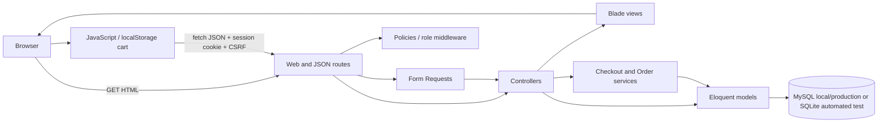

# Kiến trúc hệ thống Food Order

## 1. Phạm vi

Food Order là modular monolith phục vụ **một cửa hàng đồ ăn**. Ứng dụng được triển khai thành một Laravel application, một database và một frontend Blade cùng domain.

Phiên bản đầu chỉ có:

- `user`: xem thực đơn, quản lý tài khoản, tạo và xem đơn của chính mình.
- `admin`: vận hành cửa hàng, quản lý danh mục/món ăn/người dùng và cập nhật trạng thái mọi đơn.

Không có merchant riêng, shipper portal, marketplace nhiều quán, microservices hoặc ứng dụng mobile trong phạm vi hiện tại.

## 2. Hiện trạng source

- `routes/web.php` mới có `GET /`.
- `FoodController@index` đọc `Category` và `Food` qua Eloquent rồi render `home.blade.php`.
- Trang chủ dùng Blade, CSS inline, JavaScript thuần và tài nguyên CDN.
- Giỏ hàng lưu ở `localStorage`.
- `handleCheckout()` chỉ hiển thị alert và xóa giỏ; chưa gọi backend.
- `OrderController` và `CategoryController` chưa có nghiệp vụ; controller `OrderDetail` placeholder đã được loại bỏ khi chuẩn hóa thành `OrderItem`.
- Bootstrap hiện chỉ nạp `routes/web.php`; chưa có `routes/api.php`.
- Local dùng MySQL; automated test dùng SQLite in-memory để cô lập và chạy nhanh.

## 3. Kiến trúc mục tiêu



Đây vẫn là một process Laravel. Các “module” là cách tổ chức code và trách nhiệm, không phải service triển khai riêng.

## 4. Frontend

### Hiện tại

- Blade render dữ liệu thực đơn ở server.
- Search/category filter gửi query string tới `GET /`.
- Cart drawer thao tác hoàn toàn trong trình duyệt.
- Tên, giá và ảnh đang được lưu trong `localStorage`.

### Mục tiêu

- Tiếp tục dùng Blade; không chuyển sang SPA.
- Giữ cart trong `localStorage` để tránh thêm bảng/session cart không cần thiết.
- JavaScript chỉ gửi `food_id`, `quantity` và ghi chú món khi checkout.
- Backend phải đọc lại món, giá và trạng thái `is_available` từ database; không tin tên/giá/tổng tiền do browser gửi.
- Dùng `fetch` cho các thao tác cần JSON, nhưng vẫn cùng domain với Laravel.
- CSRF token đã có trong layout và phải được gửi ở header `X-CSRF-TOKEN` cho request thay đổi dữ liệu.

Vite đã được cấu hình cho `resources/css/app.css` và `resources/js/app.js`, nhưng trang chủ hiện chưa dùng `@vite`. Việc tách dần CSS/JS inline sang asset pipeline chỉ làm ở sprint tích hợp, không phải điều kiện để triển khai backend.

## 5. Backend

### Route

Để giữ session authentication đơn giản và không thêm package token authentication, JSON endpoints phiên bản đầu sẽ:

- Có prefix `/api/v1`.
- Được khai báo trong một route group tại `routes/web.php`.
- Dùng middleware `web`, session cookie, CSRF, `auth` và `admin` khi phù hợp.

Đây là quyết định có chủ ý vì `bootstrap/app.php` hiện chỉ nạp web routes và project chưa có Laravel Sanctum. Khi có mobile client hoặc public API, lúc đó mới tách `routes/api.php` và quyết định token authentication.

### Các lớp trách nhiệm

| Lớp | Trách nhiệm |
| --- | --- |
| Routes | Khai báo URL, middleware, route model binding |
| Controllers | Nhận request, gọi nghiệp vụ, trả view/JSON; không chứa tính toán lớn |
| Form Requests | Validation và authorization ở mức request |
| Policies/middleware | Kiểm tra chủ sở hữu, role và tài khoản active |
| Services/Actions | Nghiệp vụ cần transaction: checkout và đổi trạng thái đơn |
| Models | Relationships, casts, query scopes nhỏ |
| Database | Foreign key, unique constraint và dữ liệu bền vững |

Không thêm repository layer vì Eloquent đã là abstraction đủ cho quy mô đồ án. Chỉ tạo service cho nghiệp vụ có nhiều bước hoặc cần transaction.

### Xử lý lỗi JSON

`bootstrap/app.php` hiện đã yêu cầu render JSON cho URL `api/*` hoặc request nhận JSON. API thống nhất dùng:

```json
{
  "message": "Mô tả lỗi",
  "errors": {
    "field": ["Chi tiết validation"]
  }
}
```

- Validation: HTTP 422.
- Chưa đăng nhập: HTTP 401.
- Không có quyền: HTTP 403.
- Không tìm thấy hoặc không nhìn thấy resource: HTTP 404.
- Xung đột trạng thái/nghiệp vụ: HTTP 409.

## 6. Database

- Local: MySQL để phát hiện sớm khác biệt migration/foreign key giống production.
- Automated test: SQLite in-memory vì cô lập và chạy nhanh; migration vẫn phải được xác nhận trên MySQL.
- Production dự kiến: MySQL 8.
- Mọi truy cập dữ liệu qua Eloquent/migrations để cùng schema logic có thể chạy trên cả hai.
- Không dùng database enum cho role/status. Dùng string có hằng số/enum PHP và validate ở application để tránh khác biệt SQLite/MySQL.
- Số tiền VNĐ dùng `DECIMAL(12,0)`, không dùng số thực.

Schema nghiệp vụ mục tiêu chỉ gồm `users`, `categories`, `foods`, `orders`, `order_items`. Chi tiết ở [DATABASE.md](DATABASE.md).

## 7. Luồng frontend → backend → database

### Duyệt món

1. Browser gọi `GET /` hoặc `GET /api/v1/foods`.
2. Controller validate filter.
3. Eloquent query foods còn bán và eager-load category.
4. Backend trả Blade HTML hoặc JSON.

### Checkout

1. User đăng nhập và cart vẫn nằm trong `localStorage`.
2. Frontend gửi thông tin nhận hàng cùng danh sách `food_id/quantity/note`.
3. Form Request validate định dạng.
4. Checkout service mở database transaction.
5. Service đọc lại foods từ DB, kiểm tra còn bán, tính `subtotal`; MVP đặt `shipping_fee=0` và `total_price=subtotal`.
6. Service tạo order trạng thái `pending` và các order items snapshot.
7. Commit transaction rồi trả order JSON.
8. Frontend chỉ xóa cart sau khi nhận response thành công.

### Cập nhật trạng thái

1. Admin gửi trạng thái kế tiếp.
2. Middleware/policy xác nhận admin active.
3. Order transition service khóa bản ghi trong transaction.
4. Service kiểm tra transition theo [ORDER_FLOW.md](ORDER_FLOW.md).
5. Nếu hợp lệ, cập nhật status/timestamp; nếu sai trả 409.

## 8. Các module chính

### Authentication

Đăng ký, đăng nhập, đăng xuất, quên/đặt lại mật khẩu và đọc user hiện tại. Dùng session authentication có sẵn trong Laravel.

### User

Hồ sơ cơ bản gồm tên, email, điện thoại và địa chỉ mặc định. User bị khóa không được đăng nhập hoặc tạo đơn mới.

### Catalog

Category và Food. Public chỉ đọc các món khả dụng; admin có CRUD và bật/tắt món.

### Cart/Checkout

Cart không có bảng riêng. Checkout chịu trách nhiệm validate lại toàn bộ item, giá và tạo order atomically.

### Order

User xem đơn của mình và chỉ được hủy order `pending`. Admin xem tất cả và cập nhật đúng state machine.

### Admin

Dashboard tối thiểu, quản lý user status, category, food và order. Admin là nhân viên vận hành của chính cửa hàng, không phải super-admin của marketplace.

## 9. Phân quyền

| Hành động | Guest | User | Admin |
| --- | :---: | :---: | :---: |
| Xem category/food khả dụng | Có | Có | Có |
| Đăng ký/đăng nhập | Có | Không cần | Không cần |
| Sửa hồ sơ của mình | Không | Có | Có |
| Tạo order | Không | Có | Có |
| Xem/hủy order của mình | Không | Có | Có |
| Xem mọi order | Không | Không | Có |
| Đổi trạng thái xử lý order | Không | Không | Có |
| CRUD category/food | Không | Không | Có |
| Khóa/mở user | Không | Không | Có |

Authorization phải được kiểm tra ở backend bằng middleware/policy, không dựa vào việc ẩn nút trong giao diện.

## 10. Quyết định kiến trúc

1. **Một cửa hàng:** bỏ merchant/shipper khỏi scope để khớp quy mô website và giảm schema.
2. **Modular monolith:** Laravel đã đáp ứng route, auth, validation, ORM và view trong một project.
3. **Blade thay vì SPA:** tận dụng frontend hiện có, giảm thêm dependency và công sức state management.
4. **Session auth:** frontend/backend cùng origin; không cần token package.
5. **Cart client-side:** dữ liệu cart không cần tồn tại lâu dài; backend luôn tính lại nên không cần `carts` table.
6. **COD trong MVP:** chưa có payment gateway hoặc webhook trong source.
7. **Không voucher/review ở foundation:** không có UI/route và không cần cho luồng đặt hàng tối thiểu.
8. **Không real-time infrastructure:** order page có thể reload hoặc polling nhẹ sau này; chưa cần Redis/WebSocket/queue.
9. **Không generic repository:** tránh thêm abstraction không tạo giá trị cho codebase nhỏ.
10. **Snapshot order item:** giữ tên và giá lúc mua ngay cả khi admin sửa/xóa món sau này.
11. **Deactivate food:** ứng dụng không cung cấp hard-delete food; admin dùng `is_available=false`. Foreign key order item vẫn `nullOnDelete` để bảo vệ lịch sử nếu có thao tác bảo trì.
12. **Ảnh URL:** giữ cơ chế URL hiện tại; chưa xây upload/storage flow.

## 11. Kết quả Sprint 0

Source đã có schema MySQL, enums, model relationships, seeders idempotent, middleware `active/admin` và testing foundation. Sprint 1 Authentication chưa được triển khai.

## 12. Quyết định còn mở

Các điểm sau chưa đủ thông tin để chốt implementation cuối, nhưng không làm thay đổi kiến trúc tổng thể:

- Format chính thức của `order_code`.
- Mail transport production cho forgot-password.
- Nhà cung cấp hosting production cụ thể; database đã chốt MySQL 8.

Các quyết định này phải được đóng trong Sprint 0 hoặc ngay trước sprint sử dụng chúng, ghi lại trong tài liệu liên quan và test acceptance criteria tương ứng.
