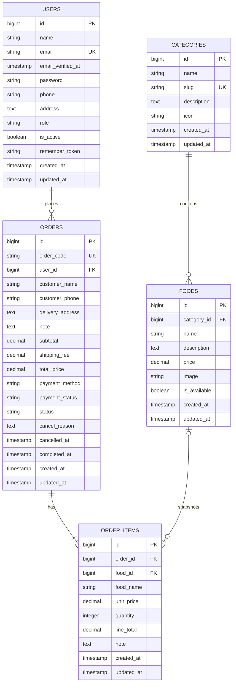

# Thiết kế database

## 1. Mục tiêu

Schema này phục vụ website đặt đồ ăn cho một cửa hàng, hai vai trò `user/admin`, checkout COD và quản lý trạng thái đơn cơ bản. Thiết kế ưu tiên:

- Đủ dữ liệu cho một order hoàn chỉnh.
- Giữ được lịch sử tên/giá món tại thời điểm đặt.
- MySQL cho local/production; SQLite in-memory chỉ dùng cho automated tests.
- Không thêm bảng chưa có nhu cầu trong MVP.

## 2. Hiện trạng implementation

Sprint 0 đã chuẩn hóa source thành `users`, `categories`, `foods`, `orders` và `order_items`. Migration cũ `order_details` được thay vì project chưa có order thật cần giữ. Schema đã chạy từ database rỗng và seed thành công trên MySQL 8.4.3; automated tests chạy cùng migrations trên SQLite in-memory.

## 3. ERD mục tiêu

`FOODS o|--o{ ORDER_ITEMS` thể hiện `food_id` được phép null sau khi món bị xóa; snapshot trong order item vẫn còn.

## 4. Chi tiết bảng

### 4.1. users

| Field | Kiểu mục tiêu | Null/default | Key/index | Mô tả |
| --- | --- | --- | --- | --- |
| `id` | BIGINT UNSIGNED | NOT NULL | PK | ID user |
| `name` | VARCHAR(255) | NOT NULL |  | Họ tên |
| `email` | VARCHAR(255) | NOT NULL | UNIQUE | Email đăng nhập, lưu dạng normalize lowercase |
| `email_verified_at` | TIMESTAMP | NULL |  | Giữ field chuẩn Laravel |
| `password` | VARCHAR(255) | NOT NULL |  | Password hash |
| `phone` | VARCHAR(20) | NULL |  | Số điện thoại mặc định |
| `address` | TEXT | NULL |  | Địa chỉ giao mặc định; checkout vẫn lưu snapshot riêng |
| `role` | VARCHAR(20) | `user` | INDEX cùng `is_active` | Chỉ nhận `user` hoặc `admin` |
| `is_active` | BOOLEAN | `true` | INDEX cùng `role` | Khóa/mở tài khoản |
| `remember_token` | VARCHAR(100) | NULL |  | Remember login của Laravel |
| `created_at` | TIMESTAMP | NULL |  | Laravel timestamp |
| `updated_at` | TIMESTAMP | NULL |  | Laravel timestamp |

Constraints:

- Email unique.
- Role được validate bằng PHP enum/hằng số và Form Request; không dùng database enum để giữ tương thích SQLite/MySQL.
- Không hard-delete user đã có order. Admin chỉ đổi `is_active`.

### 4.2. categories

| Field | Kiểu mục tiêu | Null/default | Key/index | Mô tả |
| --- | --- | --- | --- | --- |
| `id` | BIGINT UNSIGNED | NOT NULL | PK | ID category |
| `name` | VARCHAR(255) | NOT NULL |  | Tên hiển thị |
| `slug` | VARCHAR(255) | NOT NULL | UNIQUE | URL/search identifier |
| `description` | TEXT | NULL |  | Mô tả |
| `icon` | VARCHAR(100) | NULL |  | Font Awesome class hiện dùng trên giao diện |
| `created_at` | TIMESTAMP | NULL |  | Laravel timestamp |
| `updated_at` | TIMESTAMP | NULL |  | Laravel timestamp |

Constraints:

- Slug unique và được backend sinh/validate.
- Không xóa category đang có food. Admin phải chuyển food sang category khác hoặc xóa/ẩn food trước.

### 4.3. foods

Giữ tên `foods` vì model, controller, seeder và view hiện tại đều đang dùng tên này; không đổi sang `products`.

| Field | Kiểu mục tiêu | Null/default | Key/index | Mô tả |
| --- | --- | --- | --- | --- |
| `id` | BIGINT UNSIGNED | NOT NULL | PK | ID món |
| `category_id` | BIGINT UNSIGNED | NOT NULL | FK, INDEX | Category chứa món |
| `name` | VARCHAR(255) | NOT NULL |  | Tên món |
| `description` | TEXT | NULL |  | Mô tả |
| `price` | DECIMAL(12,0) | NOT NULL |  | Giá VNĐ, không có phần thập phân |
| `image` | VARCHAR(2048) | NULL |  | URL ảnh; chưa có upload file trong MVP |
| `is_available` | BOOLEAN | `true` | COMPOSITE INDEX | Có được hiển thị/đặt hay không |
| `created_at` | TIMESTAMP | NULL |  | Laravel timestamp |
| `updated_at` | TIMESTAMP | NULL |  | Laravel timestamp |

Foreign key:

- `foods.category_id -> categories.id`.
- `ON DELETE RESTRICT` để không vô tình xóa cả catalog.

Index:

- `INDEX(category_id, is_available)` cho truy vấn trang chủ theo category.
- Không thêm full-text index ở MVP; catalog nhỏ và code hiện tìm bằng `LIKE`.

Validation:

- `price >= 0`.
- Tên bắt buộc.
- Chỉ admin được ghi.
- Ứng dụng không hard-delete food; admin chuyển `is_available=false`.

### 4.4. orders

| Field | Kiểu mục tiêu | Null/default | Key/index | Mô tả |
| --- | --- | --- | --- | --- |
| `id` | BIGINT UNSIGNED | NOT NULL | PK | ID nội bộ |
| `order_code` | VARCHAR(32) | NOT NULL | UNIQUE | Mã cho user/admin tra cứu |
| `user_id` | BIGINT UNSIGNED | NOT NULL | FK, INDEX | Người đặt |
| `customer_name` | VARCHAR(255) | NOT NULL |  | Snapshot tên người nhận |
| `customer_phone` | VARCHAR(20) | NOT NULL |  | Snapshot số điện thoại |
| `delivery_address` | TEXT | NOT NULL |  | Snapshot địa chỉ giao |
| `note` | TEXT | NULL |  | Ghi chú chung |
| `subtotal` | DECIMAL(12,0) | NOT NULL |  | Tổng line items do backend tính |
| `shipping_fee` | DECIMAL(12,0) | `0` |  | MVP cố định bằng 0 |
| `total_price` | DECIMAL(12,0) | NOT NULL |  | `subtotal + shipping_fee` |
| `payment_method` | VARCHAR(20) | `cod` |  | MVP chỉ cho phép `cod` |
| `payment_status` | VARCHAR(20) | `unpaid` |  | `unpaid` hoặc `paid` |
| `status` | VARCHAR(20) | `pending` | COMPOSITE INDEX | State machine của order |
| `cancel_reason` | TEXT | NULL |  | Có giá trị khi cancelled |
| `cancelled_at` | TIMESTAMP | NULL |  | Thời điểm hủy |
| `completed_at` | TIMESTAMP | NULL |  | Thời điểm hoàn thành |
| `created_at` | TIMESTAMP | NULL | INDEX cùng user/status | Laravel timestamp |
| `updated_at` | TIMESTAMP | NULL |  | Laravel timestamp |

Foreign key:

- `orders.user_id -> users.id ON DELETE RESTRICT`.

Index:

- `UNIQUE(order_code)`.
- `INDEX(user_id, created_at)` cho lịch sử đơn của user.
- `INDEX(status, created_at)` cho hàng đợi xử lý của admin.

Constraints/nghiệp vụ:

- `subtotal`, `shipping_fee`, `total_price` không âm và không lấy từ request.
- Trong MVP: `shipping_fee = 0` và `total_price = subtotal`.
- Status phải thuộc `pending|confirmed|preparing|delivering|completed|cancelled`.
- `completed` và `cancelled` là terminal.
- Khi COD chuyển `completed`, backend đồng thời đặt `payment_status=paid`.
- Chuyển status phải qua một transition service, không mass-assign trực tiếp.

### 4.5. order_items

| Field | Kiểu mục tiêu | Null/default | Key/index | Mô tả |
| --- | --- | --- | --- | --- |
| `id` | BIGINT UNSIGNED | NOT NULL | PK | ID dòng hàng |
| `order_id` | BIGINT UNSIGNED | NOT NULL | FK, INDEX | Order cha |
| `food_id` | BIGINT UNSIGNED | NULL | FK, INDEX | Tham chiếu món nếu còn tồn tại |
| `food_name` | VARCHAR(255) | NOT NULL |  | Snapshot tên món |
| `unit_price` | DECIMAL(12,0) | NOT NULL |  | Snapshot giá lúc đặt |
| `quantity` | SMALLINT UNSIGNED | NOT NULL |  | Số lượng, tối thiểu 1 |
| `line_total` | DECIMAL(12,0) | NOT NULL |  | `unit_price * quantity` |
| `note` | TEXT | NULL |  | Ghi chú riêng cho món |
| `created_at` | TIMESTAMP | NULL |  | Laravel timestamp |
| `updated_at` | TIMESTAMP | NULL |  | Laravel timestamp |

Foreign keys:

- `order_items.order_id -> orders.id ON DELETE CASCADE`.
- `order_items.food_id -> foods.id ON DELETE SET NULL`.

Giữ `food_name` và `unit_price` là redundancy có chủ ý để order cũ không thay đổi khi admin sửa món. Backend tạo snapshot từ database, không lấy snapshot do frontend gửi.

Luồng ứng dụng chỉ deactivate food bằng `is_available=false`. `food_id` nullable + `ON DELETE SET NULL` là lớp bảo vệ dữ liệu lịch sử nếu food bị xóa bởi thao tác bảo trì hoặc migration về sau.

## 5. Relationships Eloquent

- `User hasMany Order`.
- `Order belongsTo User`.
- `Category hasMany Food`.
- `Food belongsTo Category`.
- `Order hasMany OrderItem`.
- `OrderItem belongsTo Order`.
- `OrderItem belongsTo Food` với relation nullable.

Models cần casts:

- Boolean: `is_active`, `is_available`.
- Decimal/money: không dùng float để tính; có thể cast integer-like hoặc decimal 0.
- Datetime: `cancelled_at`, `completed_at`.
- Password: hashed cast hiện có ở User.

## 6. Bảng framework giữ nguyên

Laravel hiện đã có các bảng hỗ trợ:

- `password_reset_tokens`.
- `sessions`.
- `cache`, `cache_locks`.
- `jobs`, `job_batches`, `failed_jobs`.

Chúng không phải module nghiệp vụ. Project chưa dùng background jobs; các bảng jobs được giữ vì có sẵn trong skeleton nhưng không yêu cầu chạy queue worker.

## 7. Những bảng chưa tạo

| Bảng | Quyết định |
| --- | --- |
| `carts`, `cart_items` | Không tạo; cart lưu localStorage, backend validate lại khi checkout |
| `addresses` | Chưa tạo; một địa chỉ mặc định ở user và snapshot ở order đủ cho MVP |
| `payments` | Chưa tạo; MVP chỉ COD |
| `vouchers` | Ngoài scope hiện tại |
| `reviews` | Ngoài scope hiện tại |
| `order_status_histories` | Chưa cần cho state machine tối thiểu; có thể thêm khi cần audit timeline |
| merchant/shipper tables | Không phù hợp website một cửa hàng |

## 8. Migration và seed strategy đã áp dụng

1. Đã cập nhật migrations users/categories/foods/orders.
2. Đã thay order_details bằng order_items.
3. Đã cập nhật models, factories và relationships.
4. Seeders dùng key ổn định để chạy lại không tạo trùng.
5. Seeder tạo một admin `role=admin` và catalog 4 categories/13 foods.
6. `migrate:fresh --seed` đã pass trên MySQL local.
7. Feature tests dùng `RefreshDatabase` đã pass trên SQLite in-memory.

Schema trong file này là **schema thực tế sau Sprint 0**.
