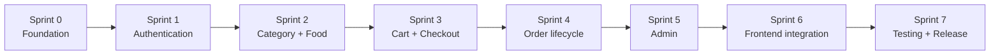

# Kế hoạch triển khai

## 1. Cách dùng kế hoạch

Kế hoạch này thay thế roadmap cũ trong `PROJECT_SPEC.md`. Nó dựa trên source thực tế:

- Chỉ có trang chủ/catalog hoạt động.
- Cart đang ở localStorage.
- Checkout là alert giả.
- Auth/RBAC chưa có.
- Orders schema đã hoàn chỉnh ở Sprint 0; controller nghiệp vụ chưa được triển khai.
- Test suite chưa xanh.

Mỗi sprint chỉ bắt đầu khi acceptance criteria của sprint trước đã đạt. Không bắt đầu Sprint 1 trước khi Sprint 0 hoàn thiện cả source foundation và tài liệu.

## 2. Thứ tự sprint

## Sprint 0 — Foundation

**Trạng thái:** Hoàn thành.

### Mục tiêu

Biến skeleton hiện tại thành nền móng ổn định, schema đúng, môi trường cài lại được và test foundation xanh. Không triển khai nghiệp vụ Auth/CRUD/Checkout hoàn chỉnh trong sprint này.

### Trạng thái đầu sprint

- Tài liệu kiến trúc/schema/API/test/deploy: đang được hoàn thiện.
- Source schema: chưa đạt thiết kế mục tiêu.
- Tests trước Sprint 0: 1 feature test fail vì SQLite in-memory chưa migrate.
- Frontend dependencies trước Sprint 0: chưa có lock file.

### Tasks

1. Chốt và review các tài liệu trong `docs/`.
2. Đánh dấu `PROJECT_SPEC.md` là tài liệu ý tưởng cũ; dùng docs mới làm source of truth.
3. Cập nhật migrations theo [DATABASE.md](DATABASE.md):
   - users: phone/address/role/is_active.
   - categories: slug required + unique.
   - foods: money type, foreign key delete rule, index.
   - orders: đầy đủ field.
   - đổi order_details thành order_items.
4. Cập nhật models, fillable/casts/relationships.
5. Tạo PHP enum hoặc constants cho user roles, order/payment statuses.
6. Sửa factories/seeders:
   - chạy lại không tạo duplicate.
   - có một admin role admin.
   - giữ 4 categories và 13 foods mẫu.
7. Cấu hình local/testing:
   - APP_NAME/locale/timezone phù hợp.
   - MySQL local; SQLite in-memory chỉ cho automated test.
   - queue dùng sync khi chưa có job.
8. Tạo middleware `active`, `admin` và đăng ký alias.
9. Chốt JSON error format cho `api/*`; không thêm route success giả.
10. Tạo Form Request/Resource base convention khi endpoint đầu tiên cần dùng; không tạo class rỗng hàng loạt.
11. Sửa feature test dùng `RefreshDatabase` và dữ liệu factory/seed tối thiểu.
12. Chạy format/syntax/test.
13. Tạo `package-lock.json`, sau đó kiểm tra `npm ci`/`npm run build`.
14. Xác nhận hướng dẫn README hoạt động trên một clone/database mới.

### Dependency

Không có. Đây là dependency của mọi sprint sau.

### File/module liên quan

- `README.md`, `PROJECT_SPEC.md`, `docs/*`.
- `.env.example`, `config/app.php`.
- `bootstrap/app.php`, `routes/web.php`.
- `database/migrations/*`, `database/factories/*`, `database/seeders/*`.
- `app/Models/*`, enum/constants, middleware.
- `phpunit.xml`, `tests/*`.
- `package-lock.json`.

### Acceptance criteria

- `php artisan migrate:fresh --seed` chạy thành công trên MySQL local.
- Bộ migration cũng chạy qua automated tests dùng SQLite in-memory.
- Database có đúng năm bảng nghiệp vụ mục tiêu và framework tables cần thiết.
- Seeders chạy lại không tạo duplicate catalog/user.
- Admin seed có role đúng; password được hash.
- Models có đầy đủ relationships/casts.
- `php artisan test` xanh.
- `npm run build` thành công.
- README setup được xác nhận bằng quy trình cài mới.
- Source chưa có route nghiệp vụ placeholder hoặc checkout success giả mới.

### Kết quả sau sprint

Project có foundation có thể tin cậy để bắt đầu Authentication. Chưa có feature lớn mới cho người dùng cuối.

## Sprint 1 — Authentication và User

**Trạng thái:** Hoàn thành.

### Mục tiêu

Có đăng ký, đăng nhập session, đăng xuất, profile và authorization cơ bản cho hai role.

### Tasks

1. Implement register/login/logout/me theo [ROUTES.md](ROUTES.md).
2. Implement profile và đổi password.
3. Implement forgot/reset password dựa trên password broker có sẵn; local ghi mail vào log.
4. Regenerate session khi login/logout.
5. Chặn account `is_active=false`.
6. Áp middleware `guest/auth/active/admin`.
7. Tạo Requests, Resources và auth tests.
8. Chỉ thêm Blade login/register tối thiểu nếu cần để kiểm tra flow; chưa redesign trang chủ.

### Dependency

Sprint 0 hoàn thành.

### File/module liên quan

- `app/Http/Controllers/Auth/*`.
- `app/Http/Requests/Auth/*`, `app/Http/Resources/UserResource.php`.
- `app/Models/User.php`, middleware/policies.
- `routes/web.php`.
- `resources/views/auth/*` nếu cần.
- `tests/Feature/Auth/*`, `tests/Feature/User/*`.

### Acceptance criteria

- User register/login/logout bằng session được.
- Password không bao giờ xuất hiện trong response/log.
- Login sai bị từ chối; inactive user bị chặn.
- User không vào admin endpoint.
- CSRF được enforce.
- Auth/user feature tests xanh.

### Kết quả sau sprint

Có identity và role foundation cho toàn bộ thao tác ghi dữ liệu.

## Sprint 2 — Category và Food

**Trạng thái:** Hoàn thành.

### Mục tiêu

Hoàn thiện catalog public và CRUD catalog cho admin mà không làm hỏng trang chủ hiện có.

### Tasks

1. Public category list/show API.
2. Public food list/show API với category/search/price/pagination.
3. Admin CRUD category.
4. Admin tạo/sửa/xem food và toggle availability; không có hard-delete API.
5. Form Requests, Resources, policies.
6. Không cho xóa category còn food.
7. Chỉ public món available; admin xem được cả unavailable.
8. Refactor `FoodController@index` dùng validation/query scopes chung khi hợp lý.
9. Bỏ rating hardcode hoặc hiển thị trung tính vì chưa có review module.
10. Viết CRUD/authorization/filter tests.

### Dependency

Sprint 1 để có admin authorization.

### File/module liên quan

- `CategoryController`, `FoodController`, admin controllers.
- `Category`, `Food`.
- Requests/Resources/Policies.
- `routes/web.php`.
- `resources/views/home.blade.php`.
- Catalog feature tests.

### Acceptance criteria

- Trang `/` tiếp tục hoạt động với seeded data.
- Public không thấy unavailable food.
- Admin CRUD được catalog; user thường nhận 403.
- Slug/price/category validation đúng.
- Xóa category có food trả 409.
- Query không phát sinh N+1 rõ ràng.
- Tests xanh.

### Kết quả sau sprint

Catalog là module hoàn chỉnh và sẵn sàng làm nguồn dữ liệu đáng tin cậy cho checkout.

## Sprint 3 — Cart và Checkout

**Trạng thái:** Hoàn thành.

### Mục tiêu

Thay alert đặt hàng giả bằng backend checkout tạo order thật, vẫn giữ cart trong localStorage.

### Tasks

1. Định nghĩa CreateOrderRequest.
2. Implement CheckoutService trong database transaction.
3. Backend đọc lại food/price/availability từ database.
4. Normalize/gộp duplicate items; validate quantity 1–99.
5. Tính subtotal từ foods; đặt shipping fee bằng 0 và total bằng subtotal.
6. Sinh order_code unique.
7. Tạo order `pending` và order item snapshots.
8. Tạo endpoint `POST /api/v1/orders`.
9. Frontend chưa cần tích hợp toàn bộ ở sprint này; dùng API tests làm contract.
10. Test rollback, món unavailable, giá client giả, cart rỗng và request lặp.

### Dependency

Sprint 2 hoàn thành; Auth và catalog phải ổn định.

### File/module liên quan

- `OrderController`.
- `CreateOrderRequest`, `OrderResource`.
- `CheckoutService`.
- `Order`, `OrderItem`, `Food`.
- Order factories/tests.

### Acceptance criteria

- User chưa login không checkout được.
- Request hợp lệ tạo đúng một order và đủ items.
- Tổng tiền chỉ dựa trên DB.
- Một item lỗi làm transaction rollback toàn bộ.
- Food unavailable trả 409/422 phù hợp.
- Cart tables không được thêm.
- Checkout feature tests xanh.

### Kết quả sau sprint

Backend đã có vertical slice đặt hàng thật, nhưng UI hiện tại chưa nối hoàn chỉnh.

## Sprint 4 — Order lifecycle

**Trạng thái:** Hoàn thành.

### Mục tiêu

User theo dõi/hủy order; admin xử lý order theo state machine bắt buộc.

### Tasks

1. User order list/detail.
2. Policy chỉ cho xem order của mình.
3. User cancel pending order.
4. Admin order list/detail với filter.
5. Implement OrderStatusService và transition map.
6. Dùng transaction + row lock cho status update.
7. Áp side effects cancelled/completed/payment status.
8. Trả 409 cho transition sai.
9. Test toàn bộ transition hợp lệ/không hợp lệ và race condition ở mức phù hợp.

### Dependency

Sprint 3 có order thật.

### File/module liên quan

- Order controllers, policy, requests/resources.
- `OrderStatusService`.
- `routes/web.php`.
- Order flow tests.

### Acceptance criteria

- Rule khớp hoàn toàn [ORDER_FLOW.md](ORDER_FLOW.md).
- Không thể skip/back/reopen status.
- User chỉ hủy own pending order.
- Completed COD đặt payment_status paid.
- Terminal state không đổi được.
- Tests xanh.

### Kết quả sau sprint

Luồng order backend hoàn chỉnh từ pending đến completed/cancelled.

## Sprint 5 — Admin

**Trạng thái:** Hoàn thành.

### Mục tiêu

Có API và giao diện quản trị tối thiểu để vận hành một cửa hàng.

### Tasks

1. Admin dashboard: counts và doanh thu completed orders.
2. Danh sách/tìm user.
3. Khóa/mở user; không cho admin tự khóa.
4. Giao diện CRUD category/food.
5. Giao diện hàng đợi order và nút transition hợp lệ.
6. Phân trang/filter để tránh tải toàn bộ bảng.
7. Admin authorization tests và aggregate tests.

### Dependency

Sprint 4.

### File/module liên quan

- `app/Http/Controllers/Admin/*`.
- Admin Requests/Resources/views.
- Admin routes.
- User/catalog/order models.
- Admin feature tests.

### Acceptance criteria

- User role thường không truy cập admin route.
- Admin quản lý catalog, user status và order được.
- Dashboard chỉ tính doanh thu completed.
- Không expose generic role update.
- Các danh sách có pagination.
- Tests xanh.

### Kết quả sau sprint

Cửa hàng có thể vận hành toàn bộ dữ liệu MVP từ admin panel.

## Sprint 6 — Kết nối frontend hiện có

### Mục tiêu

Nối giao diện Blade/cart hiện tại với Auth, checkout và order APIs mà không thay đổi phong cách UI không cần thiết.

### Tasks

1. Di chuyển JavaScript cart khỏi inline Blade sang `resources/js` theo từng bước.
2. Bổ sung `@vite` vào layout khi asset đã sẵn sàng.
3. Dùng JSON serialization an toàn thay cho inline string trong `onclick`.
4. Escape data khi render cart; không ghép input không tin cậy vào `innerHTML`.
5. Thay `handleCheckout` alert bằng form checkout + fetch.
6. Chỉ xóa localStorage cart sau HTTP 201.
7. Hiển thị validation/API errors.
8. Tạo trang order list/detail/progress.
9. Hiển thị auth state trên navbar.
10. Kiểm tra responsive và external asset failures.

### Dependency

Sprint 1–5 APIs ổn định.

### File/module liên quan

- `resources/views/layouts/app.blade.php`.
- `resources/views/home.blade.php`.
- Các view auth/checkout/orders/admin.
- `resources/js/app.js`, `resources/css/app.css`.
- Vite config nếu thực sự cần thay đổi.

### Acceptance criteria

- Luồng browser: login → thêm cart → checkout → xem order hoạt động.
- Không còn success alert giả.
- Không tin giá localStorage.
- Cart không mất khi API lỗi.
- Không có stored/DOM XSS rõ ràng từ tên/ảnh món.
- `npm run build` thành công.

### Kết quả sau sprint

Frontend hiện có sử dụng backend thật end-to-end.

## Sprint 7 — Testing, hardening và release

### Mục tiêu

Ổn định toàn hệ thống, kiểm tra production build và hoàn thiện tài liệu vận hành.

### Tasks

1. Bổ sung các test case còn thiếu theo [TESTING.md](TESTING.md).
2. Chạy full suite trên SQLite in-memory và migration/test smoke trên MySQL staging.
3. Kiểm tra authorization cho mọi write route.
4. Kiểm tra validation, pagination, N+1 và query indexes.
5. Kiểm tra CSRF, session regeneration, inactive account.
6. Kiểm tra production build/config cache.
7. Manual browser QA trên desktop/mobile.
8. Kiểm tra APP_DEBUG=false không lộ stack trace.
9. Cập nhật README/DEPLOYMENT theo quy trình đã chạy thật.
10. Backup/restore rehearsal cho database production.

### Dependency

Tất cả sprint trước.

### File/module liên quan

- `tests/*`.
- Config/environment/docs.
- Toàn bộ modules đã implement.

### Acceptance criteria

- Full PHPUnit suite xanh.
- Frontend production build xanh.
- Critical manual flows pass.
- Không còn route placeholder hoặc hardcoded success/rating sai.
- Production deploy checklist hoàn thành.
- README và docs khớp source cuối.

### Kết quả sau sprint

MVP sẵn sàng demo/triển khai cho một cửa hàng.

## 3. Ngoài phạm vi kế hoạch hiện tại

- Multi-store/merchant.
- Shipper account/dispatch/GPS.
- Voucher.
- Review/rating.
- Online payment.
- Realtime WebSocket.
- Redis, queue worker, microservices.
- Native mobile app.

Những phần này chỉ được đưa vào roadmap mới sau khi MVP một cửa hàng hoàn thành và có yêu cầu cụ thể.
