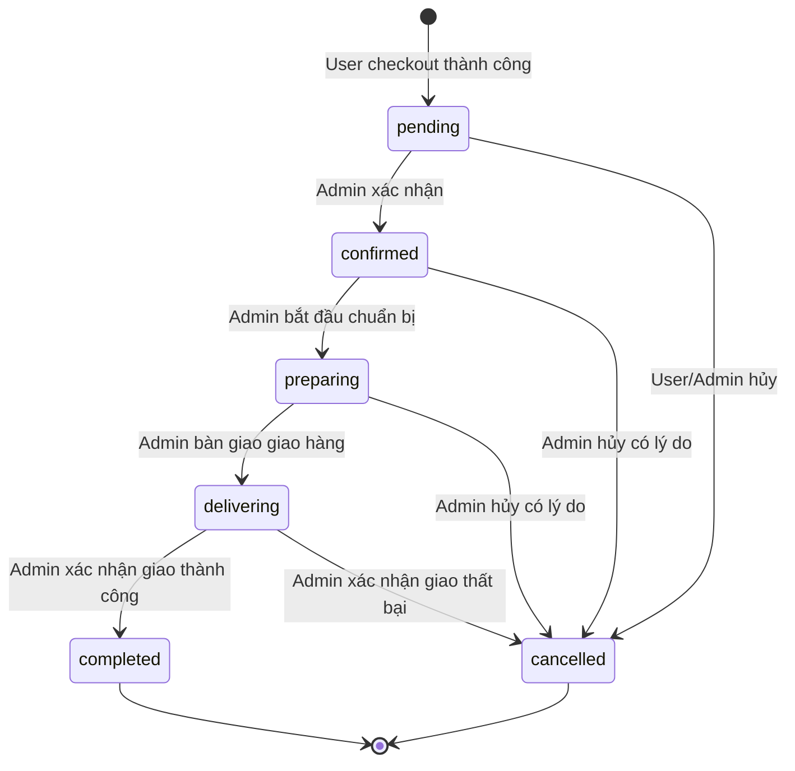

# Luồng trạng thái đơn hàng

## 1. Mục tiêu

Order status phải phản ánh đúng tiến trình xử lý của một cửa hàng:

`pending → confirmed → preparing → delivering → completed`

`cancelled` là nhánh kết thúc khi order không thể tiếp tục. Frontend chỉ hiển thị thao tác phù hợp; backend mới là nơi quyết định transition có hợp lệ hay không.

Giá trị lưu trong database dùng chữ thường:

- `pending`
- `confirmed`
- `preparing`
- `delivering`
- `completed`
- `cancelled`

## 2. State machine



## 3. Ý nghĩa từng trạng thái

| Status | Ý nghĩa | Người tạo/chuyển vào |
| --- | --- | --- |
| `pending` | Order vừa được tạo, chờ cửa hàng kiểm tra | Backend khi user checkout |
| `confirmed` | Cửa hàng nhận xử lý order | Admin |
| `preparing` | Cửa hàng đang chuẩn bị món | Admin |
| `delivering` | Order đã rời cửa hàng và đang giao | Admin |
| `completed` | Giao thành công; COD được coi là đã thu | Admin |
| `cancelled` | Order dừng và không được xử lý tiếp | User hoặc Admin theo rule bên dưới |

## 4. Ma trận transition

| Trạng thái hiện tại | Trạng thái đích | User | Admin | Điều kiện |
| --- | --- | :---: | :---: | --- |
| Không có | `pending` | Có | Có | Chỉ thông qua checkout; backend tạo order |
| `pending` | `confirmed` | Không | Có | Order còn tồn tại và chưa bị xử lý bởi request khác |
| `pending` | `cancelled` | Có | Có | User chỉ được hủy order của chính mình |
| `confirmed` | `preparing` | Không | Có | Đi đúng bước kế tiếp |
| `confirmed` | `cancelled` | Không | Có | Bắt buộc có lý do |
| `preparing` | `delivering` | Không | Có | Đi đúng bước kế tiếp |
| `preparing` | `cancelled` | Không | Có | Bắt buộc có lý do |
| `delivering` | `completed` | Không | Có | Xác nhận giao thành công |
| `delivering` | `cancelled` | Không | Có | Chỉ khi giao thất bại, bắt buộc có lý do |
| `completed` | Bất kỳ | Không | Không | Terminal |
| `cancelled` | Bất kỳ | Không | Không | Terminal |

Không cho phép:

- Bỏ qua bước, ví dụ `pending → preparing`.
- Đi lùi, ví dụ `delivering → confirmed`.
- Gửi lại đúng status hiện tại như một transition thành công.
- Mở lại order `completed` hoặc `cancelled`.
- User tự xác nhận/chuẩn bị/giao/hoàn thành order.
- User hủy order từ `confirmed` trở đi.

## 5. Quyền của User

User có thể:

1. Checkout để backend tạo order `pending`.
2. Xem order của chính mình.
3. Hủy order của chính mình khi status đang là `pending`.

Khi user hủy:

- `status = cancelled`.
- `cancelled_at = now()`.
- `cancel_reason` có thể lấy từ request; nếu bỏ trống backend dùng lý do mặc định “Khách hàng hủy đơn”.
- Không thay đổi/xóa order items.

Nếu order không thuộc user, backend trả 404 để không làm lộ sự tồn tại của order khác.

## 6. Quyền của Admin

Admin đại diện cửa hàng và có thể:

- Xem mọi order.
- Chuyển order sang **đúng trạng thái kế tiếp**.
- Hủy order ở `pending`, `confirmed`, `preparing` hoặc `delivering`.

Admin phải gửi `cancel_reason` khi hủy từ `confirmed` trở đi. Hủy ở `delivering` chỉ dùng cho tình huống giao thất bại.

Admin không được sửa trực tiếp `status` qua generic update endpoint; phải gọi endpoint transition riêng.

## 7. Side effects

| Transition | Side effect bắt buộc |
| --- | --- |
| Create → `pending` | Tạo order + items trong một transaction |
| Bất kỳ trạng thái hợp lệ → `cancelled` | Ghi `cancelled_at` và `cancel_reason` |
| `delivering → completed` | Ghi `completed_at`; với COD đặt `payment_status=paid` |
| Transition khác | Xóa `cancel_reason/cancelled_at` không được phép; giữ null từ đầu |

Project chưa có notification, inventory quantity hoặc refund, nên state transition hiện không phát sinh các side effect đó.

## 8. Backend enforcement

Transition map mục tiêu:

```php
[
    'pending' => ['confirmed', 'cancelled'],
    'confirmed' => ['preparing', 'cancelled'],
    'preparing' => ['delivering', 'cancelled'],
    'delivering' => ['completed', 'cancelled'],
    'completed' => [],
    'cancelled' => [],
]
```

Backend implementation trong Sprint 4 phải:

1. Xác thực session.
2. Kiểm tra account active và role/ownership.
3. Validate target status và cancel reason.
4. Mở transaction.
5. Đọc/khóa order hiện tại để tránh hai request cập nhật cùng lúc.
6. So sánh current status với transition map.
7. Cập nhật status và side effects.
8. Commit rồi trả order mới.

Logic này đặt trong một `OrderStatusService` hoặc action tương đương, không lặp ở controller.

## 9. Response khi transition lỗi

| Tình huống | HTTP | Ví dụ message |
| --- | ---: | --- |
| Chưa đăng nhập | 401 | `Unauthenticated.` |
| Sai role/ownership | 403 hoặc 404 | `Bạn không có quyền cập nhật đơn hàng này.` |
| Order không tồn tại | 404 | `Không tìm thấy đơn hàng.` |
| Thiếu/sai target status | 422 | `Trạng thái không hợp lệ.` |
| Thiếu lý do hủy | 422 | `Vui lòng nhập lý do hủy đơn.` |
| Transition sai thứ tự | 409 | `Không thể chuyển từ preparing sang completed.` |
| Order đã được request khác đổi trạng thái | 409 | Trả current status mới để frontend reload |

## 10. Hiển thị frontend

- User chỉ thấy nút “Hủy đơn” ở `pending`.
- Admin chỉ thấy nút của bước kế tiếp và nút hủy khi được phép.
- Progress bar có thể hiển thị năm trạng thái thành công; `cancelled` hiển thị nhánh riêng.
- Frontend phải xử lý HTTP 409 và tải lại order; không tự sửa trạng thái local.

Ẩn nút không phải authorization. Mọi rule trong tài liệu này phải được kiểm tra lại ở backend.
